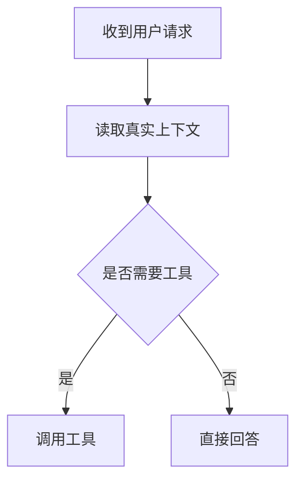
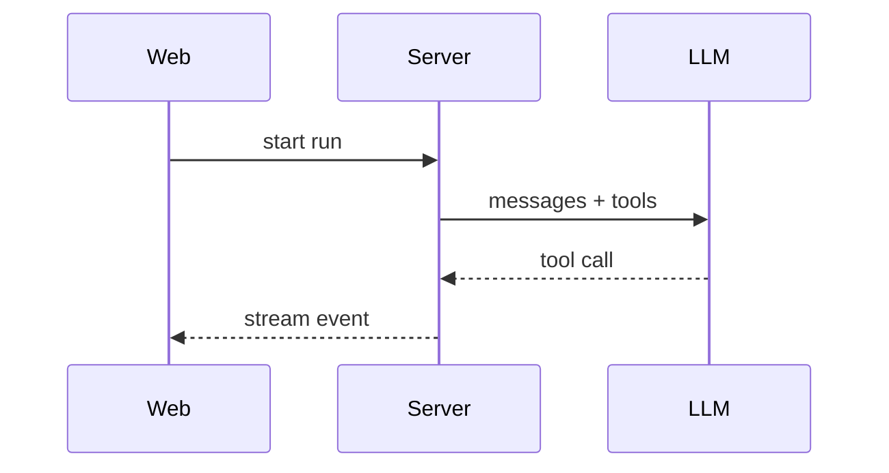
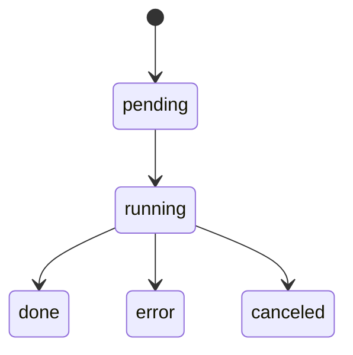

# Presentation Guide

## Mermaid vs HTML Artifact

用 Mermaid 的场景：

- 回答中需要一个轻量结构图。
- 图的重点是逻辑关系，不是精确数值。
- 节点和边不多，读者能一眼看懂。
- 图可以直接放进 Markdown。

用 HTML artifact 的场景：

- 需要真实数值图表，例如折线图、柱状图、面积图、散点图。
- 需要多个图、筛选、排序、tooltip 或响应式布局。
- 需要复杂报表、dashboard、数据大屏或可交互页面。
- 需要更强的样式控制或图表库。

不用图的场景：

- 内容只有 3-5 个要点，列表更清楚。
- 数据太少，图会制造假精确感。
- 关系太密，图会比正文更难读。

## Mermaid Choices

- 流程和决策：`flowchart`
- 时序交互：`sequenceDiagram`
- 时间线和里程碑：`timeline`
- 任务计划和排期：`gantt`
- 实体关系和数据模型：`erDiagram`
- 状态流转：`stateDiagram-v2`
- 用户旅程：`journey`
- Git 分支：`gitGraph`
- 象限分类：`quadrantChart`
- 需求或验收关系：`requirementDiagram`
- C4 架构视图：`C4Context` 或 `C4Container`

## Mermaid Rules

- 节点 ID 使用英文字母、数字和下划线。
- 中文、空格、符号、HTML、斜杠或 @ 放在 quoted label 中。
- 图里只放关键路径，例外和细节放正文。
- 超过 25 个节点时拆图或改用列表。

## Examples

流程：

时序：

状态：

